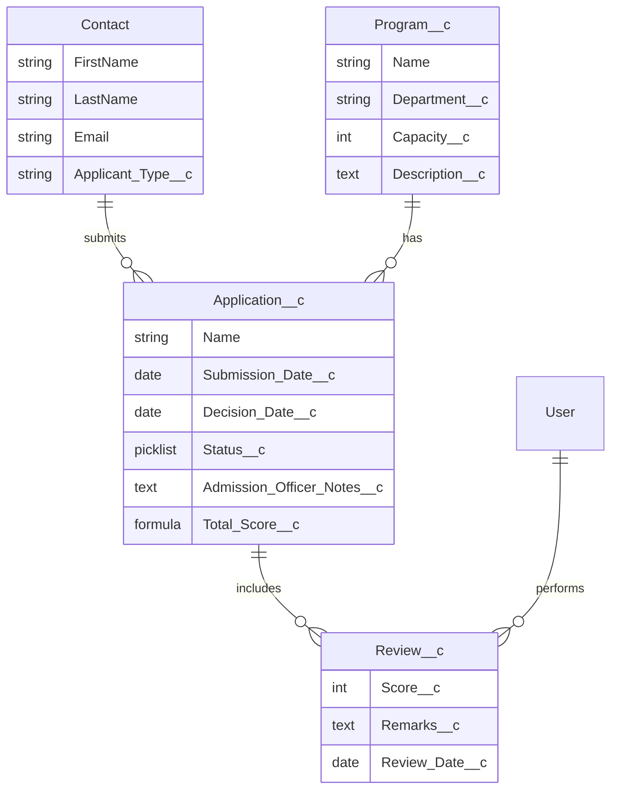
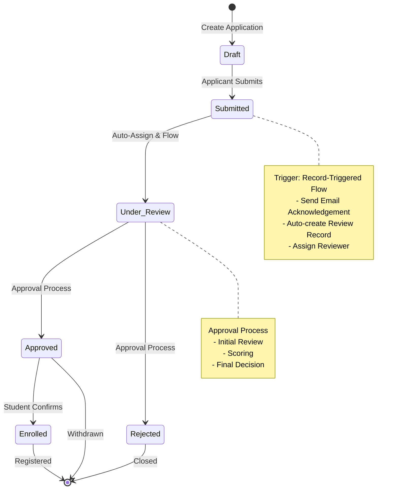
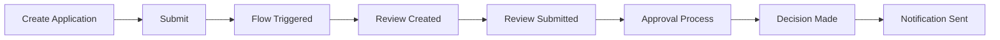

# 🎓 AI-Enabled Student Admission System

## 📋 Project Overview

The **AI-Enabled Student Admission System** is a comprehensive Salesforce solution designed to streamline and automate the complete student admission lifecycle. This system leverages Salesforce's declarative capabilities, automation tools, and AI-powered features (Agentforce) to create an efficient, transparent, and intelligent admission management process.

### 🎯 Business Objectives

- **Automate** the entire admission workflow from application submission to final enrollment
- **Enhance** decision-making through AI-powered recommendations
- **Improve** applicant experience with real-time status updates and automated communications
- **Ensure** data integrity with robust validation rules and duplicate prevention
- **Optimize** reviewer workload with intelligent application assignment
- **Provide** comprehensive visibility into admission metrics and bottlenecks

---

## 🏗️ System Architecture

### Core Components

```
┌─────────────────────────────────────────────────────────────┐
│                 Lightning App - Student Admission            │
├─────────────────────────────────────────────────────────────┤
│                                                               │
│  ┌─────────────┐    ┌─────────────┐    ┌─────────────┐     │
│  │  Programs   │    │ Application │    │   Reviews   │     │
│  │             │    │             │    │             │     │
│  │ • Capacity  │    │ • Applicant │    │ • Score     │     │
│  │ • Department│    │ • Program   │    │ • Reviewer  │     │
│  │ • Desc      │    │ • Status    │    │ • Remarks   │     │
│  └─────────────┘    └─────────────┘    └─────────────┘     │
│         ▲                  ▲                  ▲              │
│         │                  │                  │              │
│         └──────────────────┴──────────────────┘              │
│                            │                                 │
│                    ┌───────▼────────┐                       │
│                    │    Automation  │                       │
│                    │    & AI Layer  │                       │
│                    └────────────────┘                       │
│                                                               │
└─────────────────────────────────────────────────────────────┘
```

### Technology Stack

| Category | Technology |
|----------|------------|
| **Platform** | Salesforce Lightning Platform |
| **Database** | Salesforce Objects (Custom & Standard) |
| **Automation** | Flow Builder, Approval Processes, Validation Rules |
| **AI Integration** | Agentforce (Einstein AI), Prompt Builder |
| **UI Framework** | Lightning Web Components, Dynamic Forms |
| **Security** | Profiles, Roles, Role Hierarchy, Sharing Settings |
| **Data Integrity** | Duplicate Rules, Matching Rules |

---

## 📊 Data Model

### Object Relationships



### Key Objects

#### 1. **Program** (`Program__c`)
- Represents academic programs offered
- Tracks capacity to prevent over-admission
- Attributes: Department, Capacity, Description

#### 2. **Application** (`Application__c`)
- Core transaction record
- Tracks complete lifecycle from draft to enrollment
- Key statuses: Draft → Submitted → Under Review → Approved/Rejected → Enrolled

#### 3. **Review** (`Review__c`)
- Captures internal evaluation
- Master-Detail relationship with Application
- Facilitates collaborative review process

---

## 🔄 Workflow & Business Processes

### Admission Lifecycle




### Key Business Rules

| Rule Type | Description | Implementation |
|-----------|-------------|----------------|
| **Validation** | Submission date cannot be future | Validation Rule |
| **Validation** | Decision date must be after submission | Validation Rule |
| **Validation** | Cannot change Approved to Rejected | Validation Rule |
| **Validation** | Program capacity check on approval | Validation Rule |
| **Automation** | Auto-assign reviewer on submission | Record-Triggered Flow |
| **Automation** | AI-powered recommendation | Agentforce Prompt |
| **Data Quality** | Prevent duplicate applicants | Duplicate Rules |
| **Security** | Role-based access control | Profiles & Roles |

---

## 🤖 AI-Powered Features (Agentforce)

### Admission Recommendation System

The system leverages **Salesforce Agentforce** to provide intelligent admission recommendations:

- **Input Factors**:
  - Applicant type (Domestic/International)
  - Program preferences
  - Review scores
  - Historical admission patterns

- **Output**:
  - Recommendation: **Highly Likely**, **Likely**, or **Unlikely**
  - AI-generated summary with reasoning
  - Key factors influencing the decision

### Implementation

```apex
// Sample AI Recommendation Result
{
    "recommendation": "Highly Likely",
    "summary": "Applicant shows strong academic profile with high review scores. 
                Previous similar applicants from same background were successfully admitted.",
    "key_factors": ["Review Score: 95%", "International Status: No", "Program Fit: Excellent"]
}
```

---

## 🚀 Deployment Guide

### Prerequisites

- Salesforce Developer Edition or Production Org
- Salesforce CLI (SF) installed
- Git for version control

### Step 1: Clone Repository

```bash
git clone https://github.com/manojsai7/StudentAdmission.git
cd StudentAdmission
```

### Step 2: Authorize Your Org

```bash
sf org login web -a AdmissionSystem
```

### Step 3: Deploy Metadata

```bash
sf project deploy start --source-dir force-app
```

### Step 4: Assign Permission Sets

```bash
sf org assign permset --name Admission_Officer
sf org assign permset --name Reviewer
```

### Step 5: Load Sample Data (Optional)

```bash
sfdx force:data:tree:import -p data/plan.json
```

---

## 🔧 Configuration Checklist

### Phase 1: Data Setup

- [ ] Create Programs (Computer Science, Business, Engineering, Arts)
- [ ] Add Sample Applicants (Contacts)
- [ ] Configure Program Capacity

### Phase 2: Automation Setup

- [x] Validation Rules
- [x] Approval Process
- [x] Record-Triggered Flow
- [x] Email Templates & Alerts

### Phase 3: AI Integration

- [x] Enable Agentforce/Einstein
- [x] Create Prompt Templates
- [x] Configure AI Recommendations

### Phase 4: Security Setup

- [x] Profiles (Admission Officer, Reviewer)
- [x] Roles & Role Hierarchy
- [x] Organization-Wide Defaults (OWD)
- [x] Duplicate & Matching Rules

### Phase 5: User Experience

- [x] Lightning App Configuration
- [x] Dynamic Forms
- [x] Page Layout Customization

---

## 📱 Key Features Walkthrough

### 1. Application Management

**Create New Application**:
1. Navigate to "Student Admission" app
2. Click "Applications" tab → "New"
3. Select Applicant and Program
4. Fill required fields
5. Save as Draft or Submit

**Track Application Status**:
- Real-time status updates
- Visual indicators for each stage
- Complete history tracking

### 2. Review Process

**For Reviewers**:
1. Access assigned reviews from "Reviews" tab
2. Evaluate application against criteria
3. Enter score and remarks
4. Submit review

**Auto-Assignment Logic**:
- Automatic reviewer assignment via Flow
- Workload distribution across review team
- Escalation for pending reviews

### 3. AI-Powered Recommendations

**How to Use**:
1. Open any Application record
2. Click "Get AI Recommendation" button
3. System analyzes applicant data
4. View recommendation and reasoning

### 4. Approval Process

**For Admission Officers**:
1. Access "Pending Approvals" in App
2. Review application and reviews
3. Approve or Reject with notes
4. Automated notifications sent to applicant

---

## 📊 Reports & Analytics

### Key Metrics Tracked

| Report Type | Purpose |
|-------------|---------|
| **Applications by Status** | Pipeline overview |
| **Program Admission Rates** | Popularity analysis |
| **Average Review Scores** | Quality assessment |
| **AI Recommendations Accuracy** | System effectiveness |
| **Time to Decision** | Process efficiency |

### Sample Reports

```sql
-- Applications by Department
SELECT Department__c, COUNT(Id) as Total_Applications
FROM Application__c
GROUP BY Department__c

-- Average Review Scores by Program
SELECT Program__c, AVG(Review__c.Score__c)
FROM Application__c
GROUP BY Program__c
```

---

## 🔒 Security Model

### Organization-Wide Defaults (OWD)

| Object | Default Sharing | Reason |
|--------|-----------------|--------|
| Application__c | Private | Sensitive student data |
| Review__c | Private | Confidential evaluations |
| Program__c | Public Read | Department information visible to all |

### Role Hierarchy

```
Dean (Top Level)
    └── Admission Officer
        └── Reviewer
```

### Profile Permissions

| Profile | Application | Review | Program |
|---------|-------------|--------|---------|
| **Admission Officer** | CRUD | Read | CRUD |
| **Reviewer** | Read | CRUD (Own) | Read |
| **Applicant** | Read (Own) | - | Read |

---

## 🧪 Testing Guide

### Test Scenarios

#### Scenario 1: Complete Admission Flow


#### Scenario 2: AI Recommendation Test
1. Create application with high scores (85+)
2. Check AI recommendation → Should be "Highly Likely"
3. Create application with low scores (<50)
4. Check AI recommendation → Should be "Unlikely"

#### Scenario 3: Validation Test
1. Try submitting application with future date → Error
2. Try changing Approved to Rejected → Error
3. Try submitting to full program → Error

---

## 🚨 Troubleshooting Guide

### Common Issues

#### 1. Flow Not Triggering
```
Issue: Application status not updating to "Under Review"
Solution: 
- Check Flow trigger criteria
- Verify all required fields are populated
- Review Flow debug logs
```

#### 2. AI Recommendations Not Showing
```
Issue: Agentforce button not visible
Solution:
- Enable Einstein/Agentforce in org
- Check Prompt Template activation
- Verify user permissions
```

#### 3. Email Notifications Not Sent
```
Issue: Applicants not receiving emails
Solution:
- Check Email Alert configuration
- Verify email deliverability settings
- Test with valid email addresses
```

---

## 📈 Performance Optimization Tips

### 1. Bulk Processing
- Use Bulk API for large data migrations
- Enable parallel processing in Flows

### 2. Data Volume Management
- Archive old applications (3+ years)
- Use indexed fields for frequently queried columns

### 3. Flow Optimization
- Minimize SOQL queries in Flows
- Use decision elements efficiently
- Cache frequently used data

---

## 🔐 Maintenance & Support

### Daily Tasks
- Monitor pending approvals
- Check for flow errors
- Review application statistics

### Weekly Tasks
- Review AI recommendations accuracy
- Update capacity planning
- Generate weekly reports

### Monthly Tasks
- Audit security settings
- Review/update validation rules
- Backup critical data

---

## 📚 Additional Resources

- [Salesforce Flow Documentation](https://developer.salesforce.com/docs/atlas.en-us.206.0.flow.meta/flow/)
- [Agentforce Implementation Guide](https://developer.salesforce.com/docs/atlas.en-us.agentforce.meta/agentforce/)
- [Salesforce Security Best Practices](https://trailhead.salesforce.com/content/learn/modules/security-basics)
- [Salesforce Data Modeling Guide](https://developer.salesforce.com/docs/atlas.en-us.256.0.data_model.meta/data_model/)

---

## 📝 Conclusion

The **AI-Enabled Student Admission System** represents a modern approach to educational administration, combining robust Salesforce features with cutting-edge AI capabilities. This solution not only streamlines the admission process but also provides intelligent insights to improve decision-making and applicant experience.

The system is:
- ✅ **Scalable** - Handles growing applications efficiently
- ✅ **Intelligent** - AI-powered recommendations
- ✅ **Secure** - Comprehensive access controls
- ✅ **Automated** - Minimizes manual intervention
- ✅ **User-Friendly** - Intuitive interface for all stakeholders

---

## 📧 Contact & Support

**Project Lead**: [Your Name]  
**Organization**: SmartBridge  
**Email**: [your.email@example.com]  
**Deployment Date**: [Current Date]  
**Version**: 1.0.0

---

*This documentation is part of the final project submission for the SmartBridge AI-Enabled Student Admission System initiative.*
